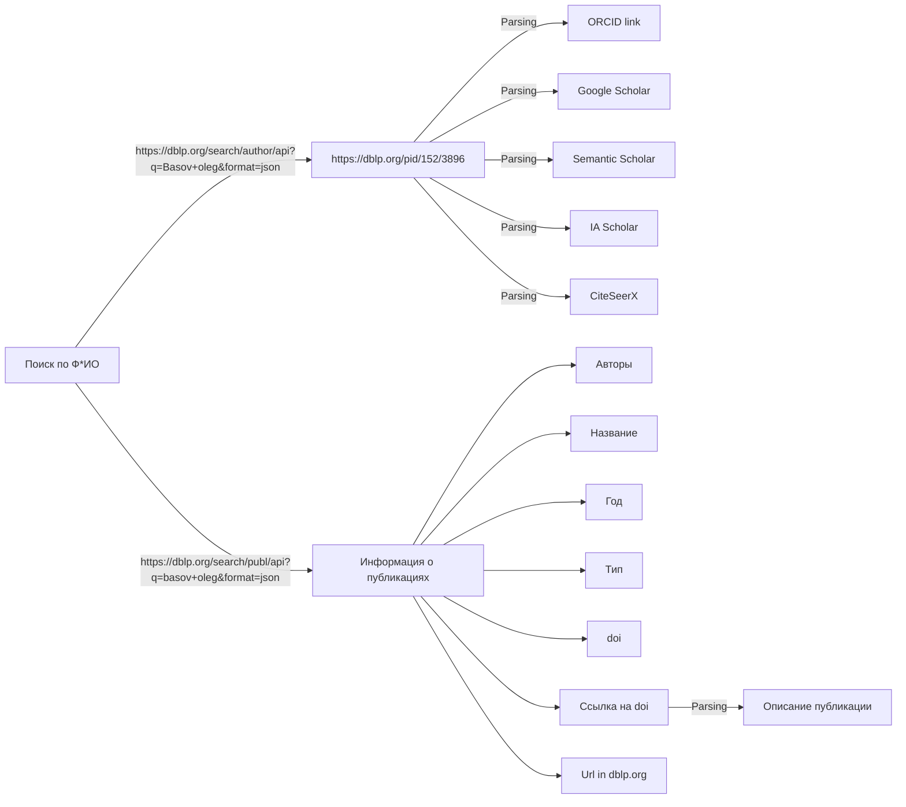

# Эксклюзив

1. https://dblp.org/search/author/api?q=Basov+oleg&format=json
Параметры поиска - `Basov+oleg`
Получаем:

```json
{
  "result": {
    "query": "Basov* oleg*",
    "status": {
      "@code": "200",
      "text": "OK"
    },
    "time": {
      "@unit": "msecs",
      "text": "0.55"
    },
    "completions": {
      "@total": "1",
      "@computed": "1",
      "@sent": "1",
      "c": {
        "@sc": "1",
        "@dc": "1",
        "@oc": "1",
        "@id": "16526948",
        "text": "oleg"
      }
    },
    "hits": {
      "@total": "1",
      "@computed": "1",
      "@sent": "1",
      "@first": "0",
      "hit": [
        {
          "@score": "3",
          "@id": "199487",
          "info": {
            "author": "Oleg Basov",
            "aliases": {
              "alias": "O. O. Basov"
            },
            "url": "https://dblp.org/pid/152/3896"
          },
          "url": "URL#199487"
        }
      ]
    }
  }
}
```

Выдергиваем данные: 
`"alias": "O. O. Basov"` - заносим в БД
`"url": "https://dblp.org/pid/152/3896"` -заносим в бд, парсим ORCID и другие ссылки на источники и заносим их БД.

2. https://dblp.org/search/publ/api?q=basov+oleg&format=json
Парметры поиска: `Basov+oleg`
Получаем:
```json
{
  "result": {
    "query": "basov* oleg*",
    "status": {
      "@code": "200",
      "text": "OK"
    },
    "time": {
      "@unit": "msecs",
      "text": "29.52"
    },
    "completions": {
      "@total": "1",
      "@computed": "1",
      "@sent": "1",
      "c": {
        "@sc": "14",
        "@dc": "14",
        "@oc": "14",
        "@id": "47043483",
        "text": "oleg"
      }
    },
    "hits": {
      "@total": "14",
      "@computed": "14",
      "@sent": "14",
      "@first": "0",
      "hit": [
        {
          "@score": "4",
          "@id": "3086138",
          "info": {
            "authors": {
              "author": [
                {
                  "@pid": "152/3896",
                  "text": "Oleg Basov"
                },
                {
                  "@pid": "152/3864",
                  "text": "Angelina Basova"
                },
                {
                  "@pid": "152/3872",
                  "text": "Maksim Nosov"
                }
              ]
            },
            "title": "Human Resources Management in Conditions of Operators&apos; Psychophysiological State Changes.",
            "venue": "SPECOM",
            "pages": "259-267",
            "year": "2014",
            "type": "Conference and Workshop Papers",
            "access": "closed",
            "key": "conf/specom/BasovBN14",
            "doi": "10.1007/978-3-319-11581-8_32",
            "ee": "https://doi.org/10.1007/978-3-319-11581-8_32",
            "url": "https://dblp.org/rec/conf/specom/BasovBN14"
          },
          "url": "URL#3086138"
        },
        {
          "@score": "3",
          "@id": "982472",
          "info": {
            "authors": {
              "author": [
                {
                  "@pid": "271/5565",
                  "text": "Dmitry Poleshenkov"
                },
                {
                  "@pid": "203/3463",
                  "text": "Ekaterina Pakulova"
                },
                {
                  "@pid": "152/3896",
                  "text": "Oleg Basov"
                },
                {
                  "@pid": "264/9030",
                  "text": "Artem Ryndin"
                }
              ]
            },
            "title": "A Heart Rate Extraction from the Speech Signal Without a Priori Information About the Speaker.",
            "venue": "IWCMC",
            "pages": "589-594",
            "year": "2020",
            "type": "Conference and Workshop Papers",
            "access": "closed",
            "key": "conf/iwcmc/PoleshenkovPBR20",
            "doi": "10.1109/IWCMC48107.2020.9148575",
            "ee": "https://doi.org/10.1109/IWCMC48107.2020.9148575",
            "url": "https://dblp.org/rec/conf/iwcmc/PoleshenkovPBR20"
          },
          "url": "URL#982472"
        },
        {
          "@score": "3",
          "@id": "1437372",
          "info": {
            "authors": {
              "author": [
                {
                  "@pid": "203/3463",
                  "text": "Ekaterina Pakulova"
                },
                {
                  "@pid": "264/9030",
                  "text": "Artem Ryndin"
                },
                {
                  "@pid": "152/3896",
                  "text": "Oleg Basov"
                }
              ]
            },
            "title": "Multi-path multimodal authentication system for remote information system.",
            "venue": "SIN",
            "pages": "26:1-26:4",
            "year": "2019",
            "type": "Conference and Workshop Papers",
            "access": "closed",
            "key": "conf/sin/PakulovaRB19",
            "doi": "10.1145/3357613.3357640",
            "ee": "https://doi.org/10.1145/3357613.3357640",
            "url": "https://dblp.org/rec/conf/sin/PakulovaRB19"
          },
          "url": "URL#1437372"
        },
        {
          "@score": "3",
          "@id": "1437377",
          "info": {
            "authors": {
              "author": [
                {
                  "@pid": "264/8876",
                  "text": "Yaroslav Tarasov"
                },
                {
                  "@pid": "203/3463",
                  "text": "Ekaterina Pakulova"
                },
                {
                  "@pid": "152/3896",
                  "text": "Oleg Basov"
                }
              ]
            },
            "title": "Modeling of low-rate DDoS-attacks.",
            "venue": "SIN",
            "pages": "24:1-24:4",
            "year": "2019",
            "type": "Conference and Workshop Papers",
            "access": "closed",
            "key": "conf/sin/TarasovPB19",
            "doi": "10.1145/3357613.3357638",
            "ee": "https://doi.org/10.1145/3357613.3357638",
            "url": "https://dblp.org/rec/conf/sin/TarasovPB19"
          },
          "url": "URL#1437377"
        },
        {
          "@score": "3",
          "@id": "1907077",
          "info": {
            "authors": {
              "author": [
                {
                  "@pid": "152/3896",
                  "text": "Oleg Basov"
                },
                {
                  "@pid": "40/7223",
                  "text": "Irina S. Kipyatkova"
                },
                {
                  "@pid": "117/8992",
                  "text": "Anton I. Saveliev"
                }
              ]
            },
            "title": "Multimodal Subscriber Interfaces for Infocommunication Systems.",
            "venue": "Comput. Informatics",
            "volume": "36",
            "number": "4",
            "pages": "908-924",
            "year": "2017",
            "type": "Journal Articles",
            "access": "closed",
            "key": "journals/cai/BasovKS17",
            "doi": "10.4149/CAI_2017_4_908",
            "ee": "https://doi.org/10.4149/cai_2017_4_908",
            "url": "https://dblp.org/rec/journals/cai/BasovKS17"
          },
          "url": "URL#1907077"
        },
        {
          "@score": "3",
          "@id": "2403428",
          "info": {
            "authors": {
              "author": [
                {
                  "@pid": "79/6948",
                  "text": "Andrey L. Ronzhin"
                },
                {
                  "@pid": "152/3896",
                  "text": "Oleg Basov"
                },
                {
                  "@pid": "182/3206",
                  "text": "Anna I. Motienko"
                },
                {
                  "@pid": "10/300",
                  "text": "Alexey Karpov 0001"
                },
                {
                  "@pid": "182/3209",
                  "text": "Yuri V. Mikhailov"
                },
                {
                  "@pid": "47/1317",
                  "text": "Milos Zelezný"
                }
              ]
            },
            "title": "Multimodal Information Coding System for Wearable Devices of Advanced Uniform.",
            "venue": "HCI",
            "pages": "539-545",
            "year": "2016",
            "type": "Conference and Workshop Papers",
            "access": "closed",
            "key": "conf/hci/RonzhinBMKMZ16",
            "doi": "10.1007/978-3-319-40349-6_52",
            "ee": "https://doi.org/10.1007/978-3-319-40349-6_52",
            "url": "https://dblp.org/rec/conf/hci/RonzhinBMKMZ16"
          },
          "url": "URL#2403428"
        },
        {
          "@score": "3",
          "@id": "2426683",
          "info": {
            "authors": {
              "author": [
                {
                  "@pid": "182/3206",
                  "text": "Anna I. Motienko"
                },
                {
                  "@pid": "184/3338",
                  "text": "Igor Dorozhko"
                },
                {
                  "@pid": "184/3362",
                  "text": "Anatoly Tarasov"
                },
                {
                  "@pid": "152/3896",
                  "text": "Oleg Basov"
                }
              ]
            },
            "title": "Proactive Robotic Systems for Effective Rescuing Sufferers.",
            "venue": "ICR",
            "pages": "172-180",
            "year": "2016",
            "type": "Conference and Workshop Papers",
            "access": "closed",
            "key": "conf/icr/MotienkoDTB16",
            "doi": "10.1007/978-3-319-43955-6_21",
            "ee": "https://doi.org/10.1007/978-3-319-43955-6_21",
            "url": "https://dblp.org/rec/conf/icr/MotienkoDTB16"
          },
          "url": "URL#2426683"
        },
        {
          "@score": "3",
          "@id": "2426687",
          "info": {
            "authors": {
              "author": [
                {
                  "@pid": "79/6948",
                  "text": "Andrey Ronzhin"
                },
                {
                  "@pid": "117/8992",
                  "text": "Anton I. Saveliev"
                },
                {
                  "@pid": "152/3896",
                  "text": "Oleg Basov"
                },
                {
                  "@pid": "184/3441",
                  "text": "Sergey Solyonyj"
                }
              ]
            },
            "title": "Conceptual Model of Cyberphysical Environment Based on Collaborative Work of Distributed Means and Mobile Robots.",
            "venue": "ICR",
            "pages": "32-39",
            "year": "2016",
            "type": "Conference and Workshop Papers",
            "access": "closed",
            "key": "conf/icr/RonzhinSBS16",
            "doi": "10.1007/978-3-319-43955-6_5",
            "ee": "https://doi.org/10.1007/978-3-319-43955-6_5",
            "url": "https://dblp.org/rec/conf/icr/RonzhinSBS16"
          },
          "url": "URL#2426687"
        },
        {
          "@score": "3",
          "@id": "2449098",
          "info": {
            "authors": {
              "author": [
                {
                  "@pid": "166/7727",
                  "text": "I. A. Saitov"
                },
                {
                  "@pid": "152/3896",
                  "text": "O. O. Basov"
                },
                {
                  "@pid": "182/3206",
                  "text": "Anna I. Motienko"
                },
                {
                  "@pid": "182/3056",
                  "text": "S. I. Saitov"
                },
                {
                  "@pid": "182/3097",
                  "text": "M. M. Bizin"
                },
                {
                  "@pid": "89/7275",
                  "text": "V. Yu. Budkov"
                }
              ]
            },
            "title": "Neural Network System for Monitoring State of a High-Speed Fiber-Optical Linear Path.",
            "venue": "ISNN",
            "pages": "497-504",
            "year": "2016",
            "type": "Conference and Workshop Papers",
            "access": "closed",
            "key": "conf/isnn/SaitovBMSBB16",
            "doi": "10.1007/978-3-319-40663-3_57",
            "ee": "https://doi.org/10.1007/978-3-319-40663-3_57",
            "url": "https://dblp.org/rec/conf/isnn/SaitovBMSBB16"
          },
          "url": "URL#2449098"
        },
        {
          "@score": "3",
          "@id": "2467129",
          "info": {
            "authors": {
              "author": [
                {
                  "@pid": "117/8992",
                  "text": "Anton I. Saveliev"
                },
                {
                  "@pid": "185/8676",
                  "text": "Sergey Saitov"
                },
                {
                  "@pid": "149/3014",
                  "text": "Irina V. Vatamaniuk"
                },
                {
                  "@pid": "152/3896",
                  "text": "Oleg Basov"
                },
                {
                  "@pid": "55/6328",
                  "text": "Nikolay Shilov 0001"
                }
              ]
            },
            "title": "Neural Network System for Monitoring State of a Optical Telecommunication System.",
            "venue": "NEW2AN",
            "pages": "39-49",
            "year": "2016",
            "type": "Conference and Workshop Papers",
            "access": "closed",
            "key": "conf/new2an/SavelievSVBS16",
            "doi": "10.1007/978-3-319-46301-8_4",
            "ee": "https://doi.org/10.1007/978-3-319-46301-8_4",
            "url": "https://dblp.org/rec/conf/new2an/SavelievSVBS16"
          },
          "url": "URL#2467129"
        },
        {
          "@score": "3",
          "@id": "2774602",
          "info": {
            "authors": {
              "author": [
                {
                  "@pid": "152/3896",
                  "text": "Oleg Basov"
                },
                {
                  "@pid": "79/6948",
                  "text": "Andrey Ronzhin"
                },
                {
                  "@pid": "89/7275",
                  "text": "Victor Budkov"
                },
                {
                  "@pid": "166/7727",
                  "text": "Igor Saitov"
                }
              ]
            },
            "title": "Method of Defining Multimodal Information Falsity for Smart Telecommunication Systems.",
            "venue": "NEW2AN",
            "pages": "163-173",
            "year": "2015",
            "type": "Conference and Workshop Papers",
            "access": "closed",
            "key": "conf/new2an/BasovRBS15",
            "doi": "10.1007/978-3-319-23126-6_15",
            "ee": "https://doi.org/10.1007/978-3-319-23126-6_15",
            "url": "https://dblp.org/rec/conf/new2an/BasovRBS15"
          },
          "url": "URL#2774602"
        },
        {
          "@score": "3",
          "@id": "2774603",
          "info": {
            "authors": {
              "author": [
                {
                  "@pid": "152/3896",
                  "text": "O. O. Basov"
                },
                {
                  "@pid": "166/7646",
                  "text": "D. A. Struev"
                },
                {
                  "@pid": "79/6948",
                  "text": "Andrey L. Ronzhin"
                }
              ]
            },
            "title": "Synthesis of Multi-service Infocommunication Systems with Multimodal Interfaces.",
            "venue": "NEW2AN",
            "pages": "128-139",
            "year": "2015",
            "type": "Conference and Workshop Papers",
            "access": "closed",
            "key": "conf/new2an/BasovSR15",
            "doi": "10.1007/978-3-319-23126-6_12",
            "ee": "https://doi.org/10.1007/978-3-319-23126-6_12",
            "url": "https://dblp.org/rec/conf/new2an/BasovSR15"
          },
          "url": "URL#2774603"
        },
        {
          "@score": "3",
          "@id": "2795384",
          "info": {
            "authors": {
              "author": [
                {
                  "@pid": "152/3896",
                  "text": "Oleg Basov"
                },
                {
                  "@pid": "79/6948",
                  "text": "Andrey Ronzhin"
                },
                {
                  "@pid": "89/7275",
                  "text": "Victor Budkov"
                }
              ]
            },
            "title": "Optimization of Pitch Tracking and Quantization.",
            "venue": "SPECOM",
            "pages": "317-324",
            "year": "2015",
            "type": "Conference and Workshop Papers",
            "access": "closed",
            "key": "conf/specom/BasovRB15",
            "doi": "10.1007/978-3-319-23132-7_39",
            "ee": "https://doi.org/10.1007/978-3-319-23132-7_39",
            "url": "https://dblp.org/rec/conf/specom/BasovRB15"
          },
          "url": "URL#2795384"
        },
        {
          "@score": "3",
          "@id": "2795421",
          "info": {
            "authors": {
              "author": [
                {
                  "@pid": "117/8992",
                  "text": "Anton I. Saveliev"
                },
                {
                  "@pid": "152/3896",
                  "text": "Oleg Basov"
                },
                {
                  "@pid": "79/6948",
                  "text": "Andrey Ronzhin"
                },
                {
                  "@pid": "167/5118",
                  "text": "Alexander L. Ronzhin"
                }
              ]
            },
            "title": "Algorithms for Low Bit-Rate Coding with Adaptation to Statistical Characteristics of Speech Signal.",
            "venue": "SPECOM",
            "pages": "65-72",
            "year": "2015",
            "type": "Conference and Workshop Papers",
            "access": "closed",
            "key": "conf/specom/SavelievBRR15",
            "doi": "10.1007/978-3-319-23132-7_8",
            "ee": "https://doi.org/10.1007/978-3-319-23132-7_8",
            "url": "https://dblp.org/rec/conf/specom/SavelievBRR15"
          },
          "url": "URL#2795421"
        }
      ]
    }
  }
}
```

Выдергиваем:
`"authors":{}` - сохраняем в БД
`"title": "Human Resources Management in Conditions of Operators&apos; Psychophysiological State Changes."`, - В БД   
`"year": "2014"` - В БД,
`"type": "Conference and Workshop Papers"` - в БД,
`"doi": "10.1007/978-3-319-11581-8_32"` - в БД,
`"ee": "https://doi.org/10.1007/978-3-319-11581-8_32"` - переходим, парсим описание и в БД,
`"url": "https://dblp.org/rec/conf/specom/BasovBN14"` - в БД.


Общая схема:

